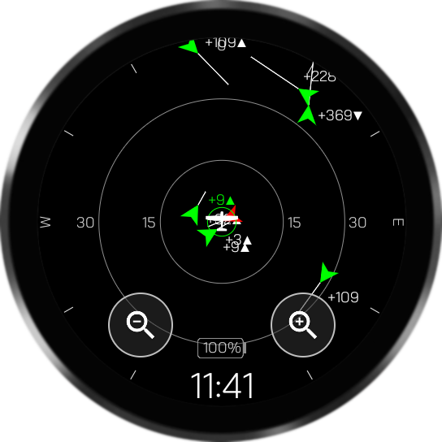
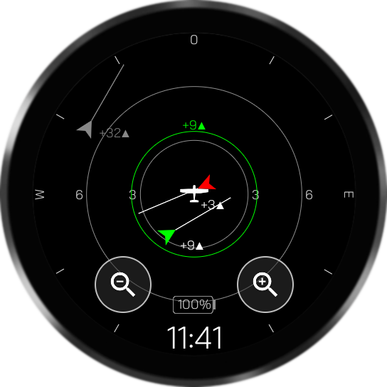
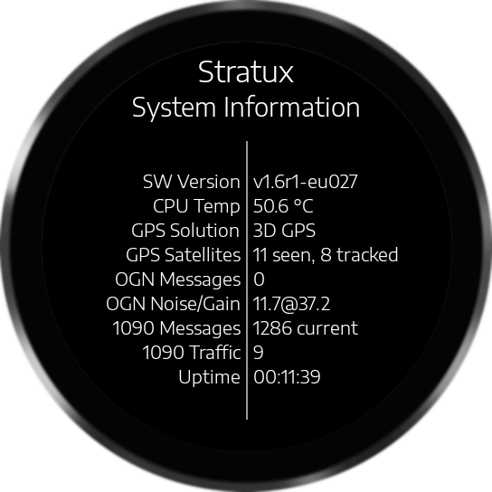
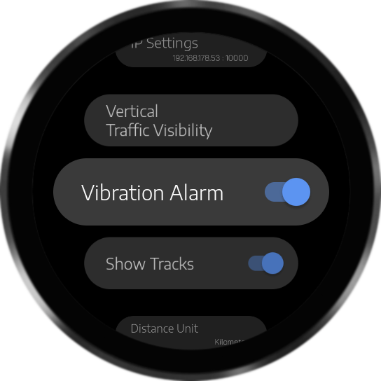

# WatchStratux
WatchStratux is an Android App for Smartwatches and displays traffic information from your DIY Stratux receiver (tested on Europe Edition only).

   

WatchStratux connects to your Stratux receiver via WiFi and processes TCP and Websocket broadcasts. 
**Caution:** To run this app properly, you need a running Stratux receiver. 
Refer to: https://github.com/b3nn0/stratux  
 
WatchStratux App has been tested on Galaxy Watch 4 (40mm), but it should run also on all other Galaxy Watch 4 and 5 versions. 
 
This app is 100% free, 100% open source, 100% non-commercial and does not collect any user data. 

## Features
 * radar view with zoom in/out function to dispay air traffic
 * vibration alert in case of traffic warning
 * adjustable IP configuration
 * adjustable vertical radar range
 * selectable between metric and nautical units
 * system information of your stratux receiver

## App Installation
This app can not be found and installed from Play Store. 
It needs to be installed by using ADB commandline tool from Android.

1. **Enable the ADB debugging interface on your watch**
	1. navigate under system settings to About (*Info zur Uhr*) -> Versions (*Softwareinfo*)
	2. tap the Build Number option (*Softwareversion*) seven times until you see the message: You are now a developer! This enables developer options on your device.
	3. navigate under system settings to developer options (*Entwickleroptionen*) and enable ADB debugging and debugging via wlan

2. **Download SDK Platform-Tools from here:** 
https://developer.android.com/tools/releases/platform-tools

3. **Connect ADB to your watch via WiFi:** 
Command: `adb connect 192.168.10.xx`

4. **Install apk file on your watch:** 
Command: `adb install WatchStratux.apk`

Now StratuxWatch is installed!

## Best Practice
 * before run the app: enable WiFi on your watch and connect to your stratux access point or to the WiFi network, where your stratux is connected to
 * the default IP configuration of stratux access point is 192.168.0.1:2000
 
## Disclaimer
Never trust and rely on any electronic system in your airplane. It can always fail at any time. 
This app does not replace your responsibility to watch the sky for traffic with your own eyes!! 
We do not recommend to use it during flight. We do not guarantee that traffic information will be displayed correctly. 
This repository offers code and binaries that helps you to bring your stratux traffic information on your smartwatch. We do not take any responsibility for what you do with this code. There is no warrenty of any kind provided with the information, code and binaries you can find here.